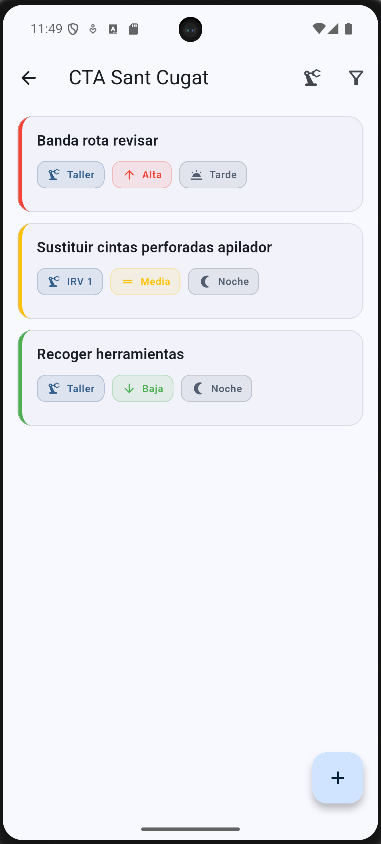
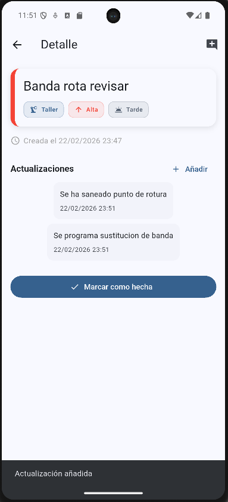

📱 Technical Task Management App

A Flutter-based mobile application designed to manage industrial maintenance tasks inside technical centers.

This project replaces informal communication (WhatsApp / verbal instructions) with a structured, traceable and scalable system.

🚩 The Problem

In industrial maintenance environments:

Tasks are communicated verbally

No historical trace exists

Incidents are lost between shifts

Priority handling is inconsistent

No structured tracking system

This leads to operational inefficiencies and lack of accountability.

💡 The Solution

This application provides:

Task creation linked to specific machines

Priority-based task classification

Task history with update tracking

Step counter per task (progress visibility)

Scalable architecture ready for multi-center support

# 📸 Screenshots

### 🏠 Task List

### 📝 Task Detail

🧱 Architecture

This project follows a feature-based, domain-oriented structure.

lib/
├── app/
├── core/
├── features/
│    ├── centers/
│    ├── machines/
│    └── tasks/
│         ├── domain/
│         ├── data/
│         └── presentation/
└── main.dart
Architectural Principles

Clear separation of concerns

Domain-driven structure

Repository pattern

Dependency injection at composition root

Scalable toward backend integration

⚙️ Current MVP Features

Task creation

Machine selection

Priority management

Task updates with history

Update counter per task

Local state management

Clean feature-based structure

🔜 In Progress

Local persistence using Drift

Multi-center support

Task status workflow (Pending / In Progress / Completed)

Filtering & sorting

Export functionality

🚀 Planned Scalability
Phase 1 – Local Robust MVP

Drift local database

Advanced filtering

Task statistics

Phase 2 – Multi-Center Architecture

Center management

Technician management

Role system

Phase 3 – Enterprise Expansion

Backend API (NestJS)

Cross-center synchronization

Spare parts request system

Technical documentation chatbot

Predictive maintenance integration

🛠 Tech Stack

Flutter (Dart)

Feature-based architecture

Repository pattern

Drift (planned local persistence)

Future-ready backend (NestJS / REST)

▶️ Run Locally
flutter pub get
flutter run
🎯 Long-Term Vision

To evolve into a scalable industrial task management platform that enables:

Standardized incident tracking

Full operational traceability

Structured inter-center communication

Future predictive maintenance integration

🧠 Why This Project Matters

This project demonstrates:

Clean architecture thinking

Domain evolution planning

Scalability-first mindset

Real-world industrial problem solving